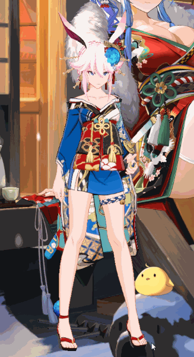
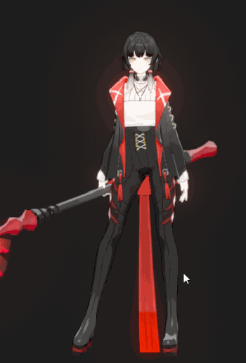

# Yae Sakura Desktop Mascot

- [八重樱桌宠，从玩游戏到做游戏](#八重樱桌宠从玩游戏到做游戏)
- [Features](#Features)
- [TODO](#TODO)
- [解决GitHub下载过慢](#解决GitHub下载过慢)

## 八重樱桌宠，从玩游戏到做游戏。

本项目的起因仅仅是因为我想把老婆放在桌面上，如果能帮助一些有兴趣但是没有基础的同学进入行业（Unity、游戏开发、Windows开发、Python、图形学等）也是极好的。

桌宠的完善依靠各位路过的舰长的努力，如语音配对、表情等，在此感谢愿意伸出援手的舰长们。

知乎专栏中做了一些技术细节的讲解：https://zhuanlan.zhihu.com/UnityGraphicsWaifu

|  | 八重樱（崩坏3） 内置崩坏3中八重樱所有**白色气泡**触摸动作（包括**特殊**触摸） 配对的语音（语音配对：MEMAUS、蹲街，式寂寞、想和陈sir啵嘴） 配对的表情（表情K帧：MEMAUS、夜星Noel） 完善的物理效果（Dynamic Bone） |
| :----------------------------------------------------------- | :----------------------------------------------------------- |
|                           | 黑尔加（永远的7日之都） 3个动作（骨骼、蒙皮、动画：Ishimura） 2个语音 暂无表情 暂无物理 美术资源待更新 |

## **Features**
- **部分美术素材来自崩坏3/永远的7日之都，特别感谢miHoYo，仅可以兴趣和同人为目的使用，禁止任何商业或低俗用途，否则后果自负**
- 操作说明：
  - 左键触摸
  - 右键旋转视角
  - 按住滚轮平移
  - 滑动滚轮缩放
- 托盘图标：
  - 单击图标显示桌宠
  - 双击图标置顶显示显示
  - 开机自启
  - 重置桌宠位置
  - 查看文档，打开GitHub项目页面
  - 手动检查更新
- 支持半透明特效、Bloom、混合抗锯齿
- 每周自动检查更新
- 暂且仅支持win10、支持多屏幕

## TODO
- 集成JTRP
- 固定位置时渲染最小Bounding以优化效率
- 更多角色

## 解决GitHub下载过慢

浏览器中启用全局代理或者黑白名单PAC通过代理下载zip，git clone则需先配置代理：

> 已剪辑自: https://blog.csdn.net/tanningzhong/article/details/52817399  
> 本地开启VPN后，GIt也需要设置代理，才能正常略过GFW，访问goole code等网站
>
> 设置如下（可复制）：
>
> git config --global https.proxy http://127.0.0.1:1080  
> git config --global https.proxy https://127.0.0.1:1080  
> git config --global http.proxy 'socks5://127.0.0.1:1080'   
> git config --global https.proxy 'socks5://127.0.0.1:1080'
>
> 取消
>
> git config --global --unset http.proxy  
> git config --global --unset https.proxy
>